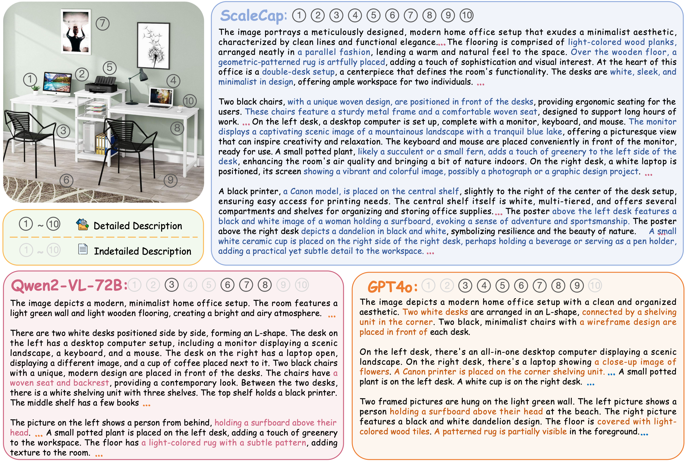
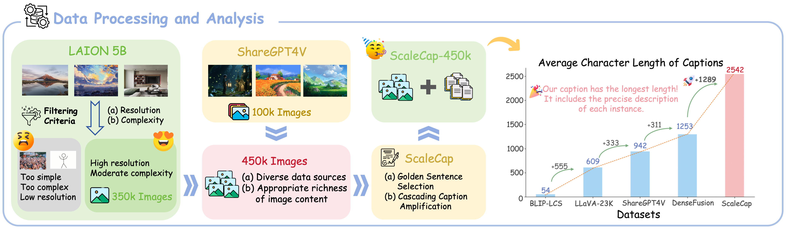
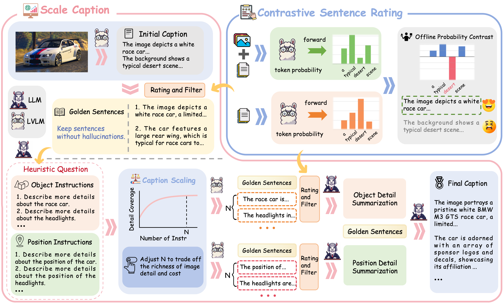

<p align="center">
<!--   <h1 align="center"></h1> -->
  <h1 align="center">ScaleCap: Inference-Time Scalable Image Captioning
via Dual-Modality Debiasing</h1>
    <p align="center">
    <a href="https://github.com/Cooperx521"><strong>Long Xing*</strong></a>
    ·
    <a href="https://github.com/shikiw"><strong>Qidong Huang*</strong></a>
    ·
    <a href="https://lightdxy.github.io/"><strong>Xiaoyi Dong</strong></a>
    ·
    <a href="https://panzhang0212.github.io/"><strong>Pan Zhang</strong></a>
    ·
    <a href="https://yuhangzang.github.io/"><strong>Yuhang Zang</strong></a>
    ·
    <a href="https://scholar.google.com/citations?user=sJkqsqkAAAAJ"><strong>Yuhang Cao</strong></a>
    ·
    <a href="https://li-jinsong.github.io/"><strong>Jinsong Li</strong></a>
    ·
  <a href="https://mark12ding.github.io/"><strong>Shuangrui Ding</strong></a> ·
  <a href="https://scholar.google.com/citations?user=eTCfl6cAAAAJ&hl=en"><strong>Weiming Zhang</strong></a> ·
  <a href="https://scholar.google.com/citations?user=7620QAMAAAAJ&hl=zh-CN"><strong>Nenghai Yu</strong></a> ·
  <a href="https://myownskyw7.github.io/"><strong>Jiaqi Wang</strong></a> ·
  <a href="https://scholar.google.com/citations?user=5bInRDEAAAAJ&hl=zh-CN"><strong>Feng Wu</strong></a> ·
  <a href="http://dahua.site/"><strong>Dahua Lin</strong></a>

  </p>
  📖<a href="https://www.arxiv.org/abs/2506.19848">Paper</a> |
  🤗<a href="https://huggingface.co/datasets/long-xing1/ScaleCap-450k">Datasets</a> | 🤗<a href="https://huggingface.co/papers/2506.19848">Daily Paper</a></h3>
<div align="center"></div>
<p align="center">
  <p>
🌈We introduce <strong>ScaleCap</strong>, an <strong>inference-time scalable image captioning</strong> strategy that generates comprehensive and detailed image captions. With ScaleCap, we construct a dataset containing <strong>450k image-caption pairs</strong> for use by the open-source community. Our key observations highlight two <strong>inherent biases</strong> in LVLMs: <strong>multimodal bias</strong> resulting in <strong>imbalanced descriptive granularity</strong>; <strong>linguistic bias</strong> leading to hallucinated descriptions of non-existent objects. To address these issues, we propose two novel components: heuristic question answering and contrastive sentence rating. Extensive experiments demonstrate the effectiveness of ScaleCap.

  </p>

<a href="">
  
</a>


## 📢 News
- 🚀 [06/25/2025] We release **ScaleCap** repository, training code and dataset.

<a href="">
  
</a>

## 💡 Highlights
- 🔥 **A plug-and-play pipeline improving caption quality**: ScaleCap can be used simply by calling either open-source or closed-source model APIs, making it extremely convenient to use.
- 🔥 **450k Image-Caption Dataset**: With ScaleCap, we construct a dataset containing 450k image-caption pairs for use by the open-source community.
- 🔥 **Extensive Experiments**: We conduct **extensive experiments** on various tasks to demonstrate effectiveness of ScaleCap.
- 🔥 **Open Source**: We fully **open-source** the training code, training data, and evaluation scripts on Github to facilitate further research.

<a href="">
  
</a>

## 👨‍💻 Todo

- [ ] Support more VQA benchmarks and complete evaluation.

## 🛠️ Setup
```
git clone https://github.com/Cooperx521/ScaleCap.git
conda create -n ScaleCap python=3.10
conda activate ScaleCap
bash setup.sh
```

## ⭐️ Quick Start

To quickly get started with generating captions using **ScaleCap**, we provide an example script. Simply run the following command:

```
bash scripts/launch_example.sh
```

### Notes

* In our setup, **Qwen** and its **VL series** are deployed using the [vLLM](https://github.com/vllm-project/vllm) framework.
* We have verified that this setup works on **NVIDIA A100** GPUs.
* If your GPU has **limited memory**, we recommend **doubling the number of devices** specified by `CUDA_VISIBLE_DEVICES` to avoid out-of-memory issues.
You may need to modify the following lines in the script to better suit your hardware configuration:

  * [Line 7](https://github.com/Cooperx521/ScaleCap/blob/ae2d1015ebf14c3fd7b389673a11da01119734b6/scripts/launch_example.sh#L7)
  * [Line 16](https://github.com/Cooperx521/ScaleCap/blob/ae2d1015ebf14c3fd7b389673a11da01119734b6/scripts/launch_example.sh#L16)


## Pretraining

### Datasets

Our **ScaleCap450k** dataset is available on :
[🔗 Hugging Face](https://huggingface.co/datasets/long-xing1/ScaleCap-450k)

This dataset contains **450,000 images** along with their corresponding **captions generated by ScaleCap**.

### Reproducing Pretraining Experiments

To reproduce the pretraining experiments presented in our paper:

1. **Initialize Qwen2.5-VL.**
   Follow the steps in the notebook [`initiallize_vlm_3b.ipynb`](https://github.com/Cooperx521/ScaleCap/blob/892ad0682defa37f54833c3c4284a9d9a5c3451e/grocery_file/initiallize_vlm_3b.ipynb) to set up the Qwen2.5-VL model for training.

2. **Training.**
   You can then use [LLaMAFactory](https://github.com/hiyouga/LLaMA-Factory) directly to run the training process.


## Comparing Caption Quality via VQA

We evaluate caption quality by **decoupling the traditional VQA (Visual Question Answering) task**:

1. First, a model generates a **caption** for the image.
2. Then, a **language model** answers questions based solely on the generated caption.

This approach allows us to assess the **informational quality and completeness** of the generated captions — if the language model can accurately answer visual questions based only on the caption, then the caption is likely high-quality.

### Inference Code

The inference pipeline can be found in the [`prism_benchmark`](https://github.com/Cooperx521/ScaleCap/tree/ea96d81f0687044694a2d8a78419d9f6b48e420c/prism_benchmark) directory.

### Evaluation Code

The scripts used to compute evaluation metrics are located in the [`eval`](https://github.com/Cooperx521/ScaleCap/tree/ea96d81f0687044694a2d8a78419d9f6b48e420c/eval) directory.


## 📄 License
  

**Usage and License Notices**: The data and code are intended and licensed for research use only.
License: Attribution-NonCommercial 4.0 International It should abide by the policy of OpenAI: https://openai.com/policies/terms-of-use

## ❤️ Acknowledgments
- [Open-LLaVA-NeXT](https://github.com/xiaoachen98/Open-LLaVA-NeXT): Thanks for the impressive open-source dataset.
- [VLMEvalKit](https://github.com/open-compass/VLMEvalKit): the amazing open-sourced suit for evaluating various LMMs!